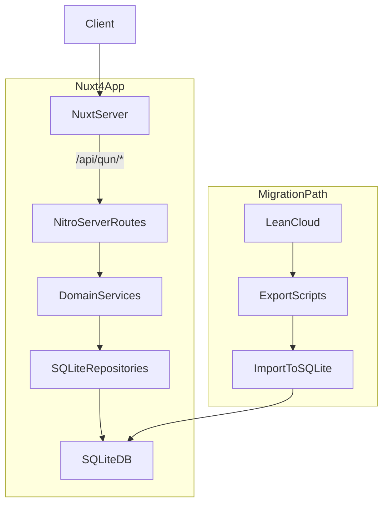

# Nuxt4 + SQLite `/qun/*` 路由迁移技术方案

## 目标与范围

- **目标**: 使用 Nuxt 4（Nuxt Bridge 时代可视为 Nuxt 3+）与 SQLite，在新项目中重写现有 v1 项目的 `/qun/*` 路由逻辑，同时尽量保持 **路由路径、请求参数、响应 JSON 结构兼容**，为后续数据从 LeanCloud 迁移到 SQLite 做好准备。
- **本次范围**: 仅覆盖 `迁移方案.md` 中列出的接口：
  - `GET  /qun/config`
  - `POST /qun/userAdd`
  - `POST /qun/userLogin`
  - `POST /qun/synchronizationUser`
  - `POST /qun/updateExp`
  - `GET  /qun/updateExp`
  - `POST /qun/updatePass`
  - `POST /qun/forgetUser`
  - `POST /qun/yungou/hook`
  - `POST /qun/yun_order_state`
  - `POST /qun/wx/qrcode`

## 整体架构设计

- **Nuxt 层**: 使用 Nuxt 4 的 server routes (`server/api/**`) 实现与当前 `/qun/*` 相同的 HTTP API。
- **业务层 (Services)**: 将每个功能（用户注册、登录、经验更新、订单查询等）封装为独立 service，保证逻辑清晰可测试。
- **数据访问层 (Repositories)**: 使用轻量 ORM / query builder（可选 Drizzle / Prisma / Kysely，或原生 sqlite3）与 SQLite 交互。
- **迁移工具**: 单独放一个 `scripts/leancloud-migrate` 目录，未来负责从 LeanCloud 导出数据并写入 SQLite。

## 目录与模块划分建议

- **Nuxt 应用结构**（示例，实际以你的项目为准）：
  - `app/`
  - `pages/`
  - `server/`
    - `api/`
      - `qun/`
        - `config.get.ts` → `/qun/config`
        - `userAdd.post.ts` → `/qun/userAdd`
        - `userLogin.post.ts` → `/qun/userLogin`
        - `synchronizationUser.post.ts` → `/qun/synchronizationUser`
        - `updateExp.post.ts` → `/qun/updateExp` (POST)
        - `updateExp.get.ts` → `/qun/updateExp` (GET 页面 / JSON)
        - `updatePass.post.ts` → `/qun/updatePass`
        - `forgetUser.post.ts` → `/qun/forgetUser`
        - `yungou/hook.post.ts` → `/qun/yungou/hook`
        - `yun_order_state.post.ts` → `/qun/yun_order_state`
        - `wx/qrcode.post.ts` → `/qun/wx/qrcode`
    - `services/`
      - `qun/`
        - `config.service.ts`
        - `user.service.ts` (注册/登录/找回密码/同步信息/修改密码)
        - `exp.service.ts` (经验值更新)
        - `order.service.ts` (云购、订单状态)
        - `pay.service.ts` (微信二维码等)
    - `db/`
      - `client.ts`（封装 SQLite 连接）
      - `schema/`
        - `users.schema.ts`
        - `orders.schema.ts`
        - `exp_log.schema.ts`
        - `config.schema.ts`
    - `repositories/`
      - `user.repository.ts`
      - `order.repository.ts`
      - `config.repository.ts`
  - `scripts/`
    - `leancloud-migrate/`
      - `export-users.ts`
      - `export-orders.ts`
      - `import-to-sqlite.ts`

## SQLite 数据库设计（初稿）

> 先根据接口行为设计表结构，后续拿到 LeanCloud 导出结构后再做字段映射与调整。

- **用户表 `users`**（对应 `/qun/userAdd`, `/qun/userLogin`, `/qun/updatePass`, `/qun/forgetUser`, `/qun/synchronizationUser`）
  - `id` (PK, integer / string，视 LeanCloud id 是否复用)
  - `username` / `mobile` / `email`
  - `password_hash`
  - `salt`（如有）
  - `exp`（当前经验值）
  - `status`（正常 / 冻结等）
  - `created_at`, `updated_at`

- **经验日志表 `exp_logs`**（对应 `/qun/updateExp`）
  - `id` (PK)
  - `user_id` (FK -> users)
  - `delta`（变动值）
  - `reason`（任务、签到、消费等）
  - `created_at`

- **订单/支付表**（对应 `/qun/yungou/hook`, `/qun/yun_order_state`, `/qun/wx/qrcode`）
  - `orders`
    - `id` (PK)
    - `user_id`
    - `yungou_order_id` / 第三方订单号
    - `amount`
    - `status`（pending / paid / failed / refunded ...）
    - `created_at`, `paid_at`
  - `payment_notifications`
    - `id` (PK)
    - `order_id`
    - `payload`（存原始回调 JSON）
    - `created_at`

- **配置表 `qun_config`**（对应 `/qun/config`）
  - `id` (PK)
  - `key`
  - `value` (JSON / TEXT)

## API 兼容策略

- **路径兼容**: Nuxt `server/api/qun/*.ts` 使用 Nitro 默认规则，生成与旧系统相同的路径：
  - 文件名使用 `name.method.ts` 形式，保证 `GET/POST` 与原接口一一对应。
- **参数兼容**:
  - **Query / body 字段名** 保持与老接口一致，比如原来 body 是 `{ mobile, password }`，新接口内部转换为 service 所需 DTO，但外部仍接受相同字段。
  - 对 `application/x-www-form-urlencoded` 与 `application/json` 的兼容（若老接口有表单提交），必要时对 body 做一层解析兼容。
- **返回兼容**:
  - 分析旧接口的典型返回格式（如 `{ code: 0, msg: 'ok', data: {...} }`），在新实现中保持相同结构与错误码语义。
  - 如果旧接口在某些错误场景会返回特殊字段（如 `need_bind_mobile` 等），新接口也保持。

## 每个路由的实现思路

- **`GET /qun/config`**
  - 从 `qun_config` 表读取相关配置（或只加载一个 JSON 配置），返回结构与旧系统保持一致。
  - 考虑添加内存缓存（Nitro 级别）减少频繁 IO。

- **`POST /qun/userAdd`**
  - 校验参数（用户名/手机号、密码、邀请码等）。
  - 通过 `user.repository` 写入 `users` 表，使用安全的密码 hash（如 bcrypt / argon2）。
  - 避免与 LeanCloud id 冲突：可以先使用自增 id，本地保留 `leancloud_id` 字段，后续迁移时填充。

- **`POST /qun/userLogin`**
  - 支持按旧逻辑的登录方式（手机+密码 / 用户名+密码 / 第三方等）。
  - 返回 token 方案：
    - 若老系统使用自身 token / session，可在 Nuxt 中用 JWT 或服务器签名 token 替代，但字段名不变（例如 `token`）。
    - Nuxt 端维护 session（可以借助 `h3` cookies 或 auth 中间件）。

- **`POST /qun/synchronizationUser`**
  - 接收来自其它系统或客户端的用户信息，依据唯一标识（如 mobile / leancloud_id）更新/创建本地用户。
  - 写入/更新 `users` 表相应字段，记录日志方便排查。

- **`POST /qun/updateExp`**
  - 解析用户标识和经验变更值 `delta`，在事务中：
    - 更新 `users.exp`。
    - 插入一条 `exp_logs` 记录。

- **`GET /qun/updateExp`**
  - 若老系统返回一个页面（比如经验修改页面），Nuxt 可渲染对应视图。
  - 若只是查询经验信息，则从 `users` / `exp_logs` 读取并返回 JSON。

- **`POST /qun/updatePass`**
  - 校验旧密码 → 校验新密码强度 → 更新 `password_hash`。

- **`POST /qun/forgetUser`**
  - 按原逻辑实现找回密码：
    - 例如发送重置链接 / 验证码 / 直接重置并返回新密码。
    - 除了业务逻辑差异，保证返回字段兼容。

- **`POST /qun/yungou/hook`**
  - 暴露给云购 / 第三方支付平台的回调地址。
  - 校验签名 / 安全性 → 更新 `orders` 状态 → 记录 `payment_notifications`。

- **`POST /qun/yun_order_state`**
  - 接受订单标识，查询本地 `orders` 状态并返回（status、amount、时间等），格式与旧接口一致。

- **`POST /qun/wx/qrcode`**
  - 根据请求生成/查询支付二维码链接。
  - 若仍依赖微信官方支付或第三方 sdk，可在 Nuxt server routes 中调用相应 SDK / HTTP API，返回 QRCode URL 或 base64 内容。

## LeanCloud → SQLite 迁移预案（后续执行）

> 目前你还没有导出 LeanCloud 数据，这一节是预留方案，未来可按此步骤落地。

- **1. 分析 LeanCloud 结构**
  - 导出 LeanCloud schema 与 sample 数据，确认：
    - 用户表（如 `_User` 或自定义表）字段 → 映射到 `users` 表。
    - 订单、支付、经验相关的 class → 对应到 `orders`、`exp_logs` 等表。

- **2. 编写导出脚本**
  - 在 `scripts/leancloud-migrate` 中使用 Node 脚本，通过 LeanCloud REST API 或官方 SDK：
    - 分页拉取所有相关数据。
    - 将导出结果保存为 JSON / CSV。

- **3. 编写导入脚本**
  - 使用同一目录下的脚本，将 JSON 数据写入 SQLite：
    - 建立 id 映射（`leancloud_id` → 本地 `id`）。
    - 保证约束（如外键关系、唯一索引）在导入前先关闭或顺序导入。

- **4. 切流方案**
  - 开发/测试环境：
    - 先在本地 SQLite 中跑完导入，验证接口在新数据上的行为与旧系统一致。
  - 生产环境迁移：
    - 确定一个“切换时间点”：先暂停旧系统写入（或进入只读），导出增量数据，写入 SQLite，然后切换 DNS/反向代理到新 Nuxt 服务。

## 安全与性能考虑

- **安全**
  - 密码统一用强 hash 算法（bcrypt/argon2）。
  - 路由中对关键操作（更新密码、经验值）增加权限检查与幂等控制。
  - 支付回调严格校验签名和 IP 白名单（如果第三方支持）。

- **性能**
  - 经验、配置等读多写少的数据可加内存缓存。
  - SQLite 通过 WAL 模式提升并发写性能，考虑限制写冲突路由的 QPS。

## 后续协作方式

- 你确认本方案后，我可以按上述结构：
  - 给出 **Nuxt 4 `server/api/qun/*` 模板代码** 和 **SQLite schema DDL**。
  - 根据你提供的 LeanCloud 导出样例，进一步细化字段映射与迁移脚本。