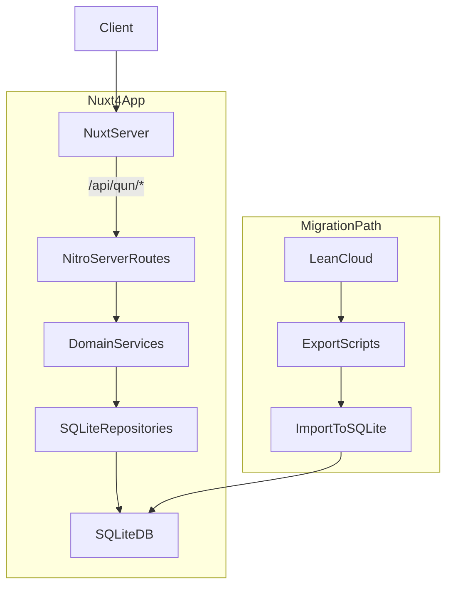

# Nuxt4 + SQLite `/qun/*` 路由迁移技术方案

## 目标与范围

- **目标**: 使用 Nuxt 4（Nuxt Bridge 时代可视为 Nuxt 3+）与 SQLite，在新项目中重写现有 v1 项目的 `/qun/*` 路由逻辑，同时尽量保持 **路由路径、请求参数、响应 JSON 结构兼容**，为后续数据从 LeanCloud 迁移到 SQLite 做好准备。
- **本次范围**: 仅覆盖 `迁移方案.md` 中列出的接口：
  - `GET  /qun/config`
  - `POST /qun/userAdd`
  - `POST /qun/userLogin`
  - `POST /qun/synchronizationUser`
  - `POST /qun/updateExp`
  - `GET  /qun/updateExp`
  - `POST /qun/updatePass`
  - `POST /qun/forgetUser`
  - `POST /qun/yungou/hook`
  - `POST /qun/yun_order_state`
  - `POST /qun/wx/qrcode`

## 整体架构设计

- **Nuxt 层**: 使用 Nuxt 4 的 server routes (`server/api/**`) 实现与当前 `/qun/*` 相同的 HTTP API。
- **业务层 (Services)**: 将每个功能（用户注册、登录、经验更新、订单查询等）封装为独立 service，保证逻辑清晰可测试。
- **数据访问层 (Repositories)**: 使用轻量 ORM / query builder（可选 Drizzle / Prisma / Kysely，或原生 sqlite3）与 SQLite 交互。
- **迁移工具**: 单独放一个 `scripts/leancloud-migrate` 目录，未来负责从 LeanCloud 导出数据并写入 SQLite。

## 目录与模块划分建议

- **Nuxt 应用结构**（示例，实际以你的项目为准）：
  - `app/`
  - `pages/`
  - `server/`
    - `api/`
      - `qun/`
        - `config.get.ts` → `/qun/config`
        - `userAdd.post.ts` → `/qun/userAdd`
        - `userLogin.post.ts` → `/qun/userLogin`
        - `synchronizationUser.post.ts` → `/qun/synchronizationUser`
        - `updateExp.post.ts` → `/qun/updateExp` (POST)
        - `updateExp.get.ts` → `/qun/updateExp` (GET 页面 / JSON)
        - `updatePass.post.ts` → `/qun/updatePass`
        - `forgetUser.post.ts` → `/qun/forgetUser`
        - `yungou/hook.post.ts` → `/qun/yungou/hook`
        - `yun_order_state.post.ts` → `/qun/yun_order_state`
        - `wx/qrcode.post.ts` → `/qun/wx/qrcode`
    - `services/`
      - `qun/`
        - `config.service.ts`
        - `user.service.ts` (注册/登录/找回密码/同步信息/修改密码)
        - `exp.service.ts` (经验值更新)
        - `order.service.ts` (云购、订单状态)
        - `pay.service.ts` (微信二维码等)
    - `db/`
      - `client.ts`（封装 SQLite 连接）
      - `schema/`
        - `users.schema.ts`
        - `orders.schema.ts`
        - `exp_log.schema.ts`
        - `config.schema.ts`
    - `repositories/`
      - `user.repository.ts`
      - `order.repository.ts`
      - `config.repository.ts`
  - `scripts/`
    - `leancloud-migrate/`
      - `export-users.ts`
      - `export-orders.ts`
      - `import-to-sqlite.ts`

## SQLite 数据库设计（基于 `db/0128` LeanCloud schema 细化）

> 现在已经有了 LeanCloud 的 schema 与数据导出（见 `db/0128` 目录），下面基于这些真实结构对 SQLite 设计和字段映射做一次收敛，后续如需再根据业务细节微调。

- **LeanCloud `_User` → 本地表 `users`**（对应 `/qun/userAdd`, `/qun/userLogin`, `/qun/updatePass`, `/qun/forgetUser`, `/qun/synchronizationUser`）
  - LeanCloud 字段（来自 `_User_schema.json`）：
    - `objectId`（String）: LeanCloud 主键
    - `username`（String）
    - `password`（String）
    - `salt`（String）
    - `email`（String）, `emailVerified`（Boolean）
    - `mobilePhoneNumber`（String）, `mobilePhoneVerified`（Boolean）
    - `nickName`（String, required）
    - `applyAt`（Date, v2）
    - `expirationAt`（Date, v2）
    - `sessionToken`（String）
    - `authData`（Object, user_private）
    - `createdAt`, `updatedAt`, `ACL`
  - 建议 SQLite 表结构（`users`）：
    - `id` INTEGER PRIMARY KEY AUTOINCREMENT
    - `lc_object_id` TEXT UNIQUE NOT NULL  — 对应 LeanCloud `objectId`
    - `username` TEXT
    - `password_hash` TEXT  — 由 LeanCloud `password` + `salt` 迁移/重新生成
    - `salt` TEXT
    - `email` TEXT
    - `email_verified` INTEGER  — 映射自 `emailVerified`
    - `mobile_phone_number` TEXT
    - `mobile_phone_verified` INTEGER
    - `nick_name` TEXT NOT NULL
    - `apply_at` DATETIME
    - `expiration_at` DATETIME  — 如果与 `Expiration` 表设计有重叠，可后续统一
    - `session_token` TEXT  — 如不希望长期持久化，可后续迁移到独立 session 表
    - `auth_data` TEXT  — JSON 存储 LeanCloud `authData`
    - `status` INTEGER DEFAULT 1  — 业务层面新增：正常/冻结等
    - `exp` INTEGER DEFAULT 0  — 当前经验值，对应 `/qun/updateExp` 的经验逻辑
    - `created_at` DATETIME
    - `updated_at` DATETIME

- **LeanCloud `Expiration` → 本地表 `user_expiration`（可选，视是否继续拆分过期信息）**
  - LeanCloud 字段（来自 `Expiration_schema.json`）：
    - `objectId`（String）
    - `userObjectId`（String, required）— 指向 `_User.objectId`
    - `userObject`（Pointer<_User>）
    - `username`（String, required）
    - `expirationAt`（Date, v2）
    - `sessionToken`（String, v2）
    - `Bot`（String, default "0"）
    - `createdAt`, `updatedAt`, `ACL`
  - 建议 SQLite 表结构（`user_expiration`，如果不想拆表，也可以直接合并回 `users`）：
    - `id` INTEGER PRIMARY KEY AUTOINCREMENT
    - `lc_object_id` TEXT UNIQUE NOT NULL
    - `user_lc_object_id` TEXT NOT NULL  — 对应 LeanCloud `userObjectId`
    - `user_id` INTEGER NOT NULL  — 外键指向本地 `users.id`
    - `username` TEXT NOT NULL
    - `expiration_at` DATETIME
    - `session_token` TEXT
    - `bot_flag` INTEGER DEFAULT 0  — 映射自 `Bot`
    - `created_at` DATETIME
    - `updated_at` DATETIME

- **经验日志表 `exp_logs`**（对应 `/qun/updateExp`）
  - 现有 LeanCloud 导出中没有独立的「经验」 class，`Expiration` 更偏向会员到期时间；为兼容 `/qun/updateExp`，在 SQLite 侧仍建议单独设计：
  - 表结构：
    - `id` INTEGER PRIMARY KEY AUTOINCREMENT
    - `user_id` INTEGER NOT NULL  — FK -> `users.id`
    - `delta` INTEGER NOT NULL  — 经验变动值
    - `reason` TEXT  — 任务/签到/消费等
    - `created_at` DATETIME NOT NULL

- **LeanCloud `qun_orders` → 本地表 `orders`**（对应 `/qun/yungou/hook`, `/qun/yun_order_state`, `/qun/wx/qrcode`）
  - LeanCloud 字段（来自 `qun_orders_schema.json`）：
    - `objectId`（String）
    - `user_id`（String, required）
    - `qr_id`（String, required）
    - `charge_id`（String, required）
    - `order_id`（String, required）
    - `amount`（String, required）
    - `day`（String, required）
    - `payway`（String, required）
    - `state`（String）
    - `refund_state`（String）
    - `refund_amount`（String）
    - `description`（String）
    - `create_time`（String, required）
    - `createdAt`, `updatedAt`, `ACL`
  - 建议 SQLite 表结构（`orders`）：
    - `id` INTEGER PRIMARY KEY AUTOINCREMENT
    - `lc_object_id` TEXT UNIQUE NOT NULL
    - `user_lc_id` TEXT NOT NULL  — 对应 LeanCloud `user_id`
    - `user_id` INTEGER  — 外键指向本地 `users.id`（可在导入阶段建立映射）
    - `qr_id` TEXT NOT NULL
    - `charge_id` TEXT NOT NULL
    - `order_id` TEXT NOT NULL
    - `amount` INTEGER NOT NULL  — 可以在导入脚本中从 String 转换为分（int）
    - `day` TEXT NOT NULL
    - `payway` TEXT NOT NULL
    - `state` TEXT  — 如 "pending" / "paid" / "failed"
    - `refund_state` TEXT
    - `refund_amount` INTEGER  — 同样建议用分
    - `description` TEXT
    - `create_time_raw` TEXT NOT NULL  — 保留原 `create_time` 文本
    - `created_at` DATETIME
    - `updated_at` DATETIME
  - 支付回调原始数据（仅存在于新系统）：
    - 新增表 `payment_notifications`：
      - `id` INTEGER PRIMARY KEY AUTOINCREMENT
      - `order_id` INTEGER NOT NULL  — FK -> `orders.id`
      - `payload` TEXT NOT NULL  — 存 webhook 原始 JSON
      - `created_at` DATETIME NOT NULL

- **LeanCloud `config` → 本地表 `qun_config`**（对应 `/qun/config`）
  - LeanCloud 字段（来自 `config_schema.json`）：
    - `objectId`（String）
    - `key`（String, required）
    - `value`（String, required）
    - `createdAt`, `updatedAt`, `ACL`
  - 建议 SQLite 表结构（`qun_config`）：
    - `id` INTEGER PRIMARY KEY AUTOINCREMENT
    - `lc_object_id` TEXT UNIQUE
    - `key` TEXT NOT NULL UNIQUE
    - `value` TEXT NOT NULL  — 若为 JSON，可在应用层做 `JSON.parse`
    - `created_at` DATETIME
    - `updated_at` DATETIME

- **LeanCloud 其它与群/微信相关的表（当前 `/qun/*` 接口未直接使用，但可预留）**
  - `Rooms`（`Rooms_schema.json`）：
    - 字段：`roomId`, `roomName`, `wxId`, `memberAll`（Array）, `userId`, `userName` 等。
    - 可映射为本地 `rooms` 表，未来若 `/qun/*` 或 IM 逻辑需要房间维度信息时使用。
  - `UserShadow`（`UserShadow_schema.json`）：
    - 字段：`wxId`, `nickName`, `userId` 等。
    - 可映射为本地 `user_shadows` 表，用于绑定 `_User` 与微信侧身份。
  - `_Role` 等权限相关 class：
    - 若新系统采用自定义权限体系，可只做「只读导入」，或先不导入，仅在将来需要兼容管理后台时再设计。

## API 兼容策略

- **路径兼容**: Nuxt `server/api/qun/*.ts` 使用 Nitro 默认规则，生成与旧系统相同的路径：
  - 文件名使用 `name.method.ts` 形式，保证 `GET/POST` 与原接口一一对应。
- **参数兼容**:
  - **Query / body 字段名** 保持与老接口一致，比如原来 body 是 `{ mobile, password }`，新接口内部转换为 service 所需 DTO，但外部仍接受相同字段。
  - 对 `application/x-www-form-urlencoded` 与 `application/json` 的兼容（若老接口有表单提交），必要时对 body 做一层解析兼容。
- **返回兼容**:
  - 分析旧接口的典型返回格式（如 `{ code: 0, msg: 'ok', data: {...} }`），在新实现中保持相同结构与错误码语义。
  - 如果旧接口在某些错误场景会返回特殊字段（如 `need_bind_mobile` 等），新接口也保持。

## 每个路由的实现思路

- **`GET /qun/config`**
  - 从 `qun_config` 表读取相关配置（或只加载一个 JSON 配置），返回结构与旧系统保持一致。
  - 考虑添加内存缓存（Nitro 级别）减少频繁 IO。

- **`POST /qun/userAdd`**
  - 校验参数（用户名/手机号、密码、邀请码等）。
  - 通过 `user.repository` 写入 `users` 表，使用安全的密码 hash（如 bcrypt / argon2）。
  - 避免与 LeanCloud id 冲突：可以先使用自增 id，本地保留 `leancloud_id` 字段，后续迁移时填充。

- **`POST /qun/userLogin`**
  - 支持按旧逻辑的登录方式（手机+密码 / 用户名+密码 / 第三方等）。
  - 返回 token 方案：
    - 若老系统使用自身 token / session，可在 Nuxt 中用 JWT 或服务器签名 token 替代，但字段名不变（例如 `token`）。
    - Nuxt 端维护 session（可以借助 `h3` cookies 或 auth 中间件）。

- **`POST /qun/synchronizationUser`**
  - 接收来自其它系统或客户端的用户信息，依据唯一标识（如 mobile / leancloud_id）更新/创建本地用户。
  - 写入/更新 `users` 表相应字段，记录日志方便排查。

- **`POST /qun/updateExp`**
  - 解析用户标识和经验变更值 `delta`，在事务中：
    - 更新 `users.exp`。
    - 插入一条 `exp_logs` 记录。

- **`GET /qun/updateExp`**
  - 若老系统返回一个页面（比如经验修改页面），Nuxt 可渲染对应视图。
  - 若只是查询经验信息，则从 `users` / `exp_logs` 读取并返回 JSON。

- **`POST /qun/updatePass`**
  - 校验旧密码 → 校验新密码强度 → 更新 `password_hash`。

- **`POST /qun/forgetUser`**
  - 按原逻辑实现找回密码：
    - 例如发送重置链接 / 验证码 / 直接重置并返回新密码。
    - 除了业务逻辑差异，保证返回字段兼容。

- **`POST /qun/yungou/hook`**
  - 暴露给云购 / 第三方支付平台的回调地址。
  - 校验签名 / 安全性 → 更新 `orders` 状态 → 记录 `payment_notifications`。

- **`POST /qun/yun_order_state`**
  - 接受订单标识，查询本地 `orders` 状态并返回（status、amount、时间等），格式与旧接口一致。

- **`POST /qun/wx/qrcode`**
  - 根据请求生成/查询支付二维码链接。
  - 若仍依赖微信官方支付或第三方 sdk，可在 Nuxt server routes 中调用相应 SDK / HTTP API，返回 QRCode URL 或 base64 内容。

## LeanCloud → SQLite 迁移预案（结合 `db/0128` 现有导出）

> 当前 `db/0128` 目录下已经包含了 LeanCloud 的 schema 与 `*_all.json` 全量数据导出，可以在此基础上直接推进迁移脚本的实现。

- **1. 映射确认（已完成 80%）**
  - 根据 `*_schema.json` 与上文 SQLite 设计，已经初步确定：
    - `_User` → `users`
    - `Expiration` → `user_expiration`（或合并进 `users`）
    - `qun_orders` → `orders`
    - `config` → `qun_config`
    - `Rooms` → `rooms`（可选）
    - `UserShadow` → `user_shadows`（可选）
  - 后续只需在实际跑一遍导入脚本时，补齐个别枚举值、状态字段的业务含义。

- **2. 导入脚本（从 `db/data/*.0.jsonl` → SQLite）**
  - 当前导出格式示例：
    - `db/data/_User.0.jsonl`
      - 第一行：`#filetype:JSON-streaming {"type":"Class","class":"_User"}`（文件头，需要在脚本中跳过）
      - 之后每一行：一个 `_User` 记录的完整 JSON，如：
        - `{"salt":"...","email":"...","sessionToken":"...","applyAt":{"__type":"Date","iso":"..."},"password":"...","objectId":"5c710c95c05a807a4d9d7179","username":"l1","createdAt":"...","emailVerified":false,"nickName":"...","mobilePhoneVerified":false,...}`
    - `db/data/Expiration.0.jsonl`
      - 文件头：`#filetype:JSON-streaming {"type":"Class","class":"Expiration"}`
      - 每行包含 `objectId`, `userObjectId`, `username`, 可选 `expirationAt`（`{"__type":"Date","iso":"..."}`）、`Bot`、`sessionToken`、`userObject`（Pointer<_User>）等字段。
    - `db/data/qun_orders.0.jsonl`
      - 文件头：`#filetype:JSON-streaming {"type":"Class","class":"qun_orders"}`
      - 每行字段与方案中梳理的 schema 基本一致：`objectId`, `user_id`, `qr_id`, `charge_id`, `order_id`, `amount`, `day`, `payway`, `state`, `refund_state`, `refund_amount`, `description`, `create_time`, `createdAt`, `updatedAt`, `ACL`。
    - `db/data/config.0.jsonl`
      - 文件头：`#filetype:JSON-streaming {"type":"Class","class":"config"}`
      - 每行：`{"key":"...","value":"...","ACL":{...},"createdAt":"...","updatedAt":"...","objectId":"..."}`。
    - `db/data/Rooms.0.jsonl`
      - 文件头：`#filetype:JSON-streaming {"type":"Class","class":"Rooms"}`，文件很大（约 25MB），建议导入脚本按行流式处理。
      - 每行会包含房间相关字段（`roomId`, `roomName`, `wxId`, `memberAll`, `userId`, `userName` 等，具体可在后续实现时按需解析）。
    - `db/data/UserShadow.0.jsonl`
      - 文件头：`#filetype:JSON-streaming {"type":"Class","class":"UserShadow"}`
      - 每行：`{"wxId":"...","nickName":"...","userId":"...","objectId":"...","createdAt":"...","updatedAt":"...","ACL":{...}}`。
  - 在 `scripts/leancloud-migrate` 下为每个核心 class 编写/完善导入脚本（部分已存在，可直接复用和扩展）：
    - `import-users-from-json.ts`：
      - 读取 `db/data/_User.0.jsonl`，跳过首行 `#filetype`，对每一行 `JSON.parse` 得到 LeanCloud `_User` 对象。
      - 按前文 `users` 表设计，填充 `lc_object_id`（来自 `objectId`）、`username`、`password_hash`（可先直接存 LeanCloud 的 `password`，后续再统一升级加密）、`salt`、`email`、`email_verified`、`nick_name` 等字段，并将 `createdAt`/`updatedAt` 转成 `DATETIME`。
    - `import-expiration-from-json.ts`：
      - 读取 `db/data/Expiration.0.jsonl`，同样跳过首行。
      - 若使用独立表：根据 JSON 中的 `objectId`、`userObjectId`、`username`、`expirationAt.iso`、`Bot`、`sessionToken` 等写入 `user_expiration` 表。
      - 若合并到 `users` 表：根据 `userObjectId` 找到对应 `users.lc_object_id`，更新 `users.expiration_at` / `users.session_token` / `users.status` 等字段。
    - `import-orders-from-json.ts`：
      - 读取 `db/data/qun_orders.0.jsonl`。
      - 将 `amount`、`refund_amount` 从字符串转换为整数金额（分）；`create_time` 原样保存到 `create_time_raw`，同时根据需要转成 `created_at` 时间。
      - 先写入 `orders` 表的 `user_lc_id` 字段（使用原始 `user_id`），在后续二次脚本中利用 `users (lc_object_id → id)` 映射补齐 `user_id` 外键。
    - `import-config-from-json.ts`：
      - 读取 `db/data/config.0.jsonl`，根据 `key`/`value` 写入 `qun_config` 表。
      - 对 value 为 JSON 字符串的配置，在应用层做 `JSON.parse`，不强依赖 DB 层 JSON 类型。
    - （可选）`import-rooms-from-json.ts`：
      - 读取 `db/data/Rooms.0.jsonl`，因为体积较大，按行流式读取，每处理一行就立即 `INSERT` / `UPSERT`。
      - 只映射当前 `/qun/*` 需要的字段，其它字段可先整体存为 JSON 文本，避免过度设计。
    - （可选）`import-user-shadow-from-json.ts`：
      - 读取 `db/data/UserShadow.0.jsonl`，写入 `user_shadows` 表。
      - 为后续根据微信 ID 反查 `_User` 或本地 `users` 留好基础数据。
  - 导入时注意：
    - 先写入拥有独立主键、无外键依赖的表（如 `users`, `qun_config`，以及无需用户外键的 `orders.user_lc_id`），再写依赖它们的表（如补齐 `orders.user_id`、`user_expiration` 等）。
    - 保存一份 `lc_object_id` → 本地 `id` 的映射（可以内存 map，也可以单独映射表），用于处理 `user_lc_id` → `user_id` 的转换以及 `Expiration.userObjectId` → `users.id` 的关联。
    - 做必要的类型转换，例如金额 String → Integer（分）、布尔 → 0/1，日期字符串/LeanCloud Date → SQLite `DATETIME`。

- **3. 与 Nuxt `/qun/*` 接口联调**
  - 在本地 SQLite 导入完成后：
    - 启动 Nuxt4 应用，使用 `/qun/userLogin`, `/qun/config`, `/qun/yun_order_state` 等接口，对比旧系统的典型请求/响应。
    - 通过对比 JSON 字段（尤其是字段名、错误码、状态含义），逐步调整 service 层的 DTO 与 repository 查询。

- **4. 生产切流方案**
  - 开发/测试环境：
    - 以 `db/0128` 这批导出为基线，反复迭代导入脚本和接口实现，确保在全量数据上行为稳定。
  - 生产环境迁移：
    - 在正式切换前再做一次最新数据导出（可基于当前的 JSON 脚本复用）。
    - 停止旧服务写入或进入只读模式，导出增量数据并导入 SQLite。
    - 完成数据校验后，将网关 / 反向代理切到 Nuxt4 服务，并在一段时间内保留回滚预案（例如保留旧服务只读访问能力以做比对）。

## 安全与性能考虑

- **安全**
  - 密码统一用强 hash 算法（bcrypt/argon2）。
  - 路由中对关键操作（更新密码、经验值）增加权限检查与幂等控制。
  - 支付回调严格校验签名和 IP 白名单（如果第三方支持）。

- **性能**
  - 经验、配置等读多写少的数据可加内存缓存。
  - SQLite 通过 WAL 模式提升并发写性能，考虑限制写冲突路由的 QPS。

## 后续协作方式

- 你确认本方案后，我可以按上述结构：
  - 给出 **Nuxt 4 `server/api/qun/*` 模板代码** 和 **SQLite schema DDL**。
  - 根据你提供的 LeanCloud 导出样例，进一步细化字段映射与迁移脚本。